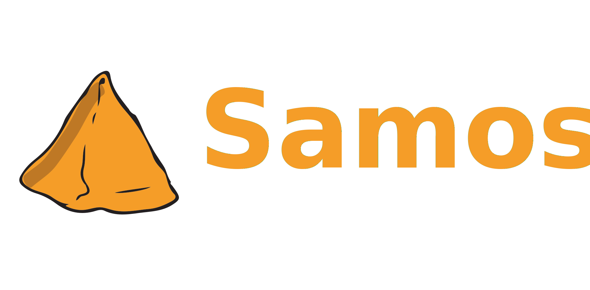

<div align="center">
    
</div>

---

# Samosa

Samosa helps developers prioritize what needs to be tested.

> ⚠️ Do not chase coverage metrics. When a measure becomes a target, it ceases to be a good measure.

Samosa isn't a tool for developers who want to chase 100% coverage; instead, it provides a good way to prioritize which functions should be tested first.

## Installation

Using go get:

```
go get -u github.com/burntcarrot/samosa/...
```

## Usage

Run Samosa:

```
samosa -f <path to coverage file> --pkg
```

Samosa returns the list of functions sorted by the impact associated with covering it:

```
File                                                    Function        Impact  Uncovered Lines Start Line      End Line
github.com/burntcarrot/samosa/internal/coverage.go      getFunctionInfo 19.15   18              46              84
github.com/burntcarrot/samosa/internal/table.go         printTable      14.89   14              20              46
github.com/burntcarrot/samosa/internal/coverage.go      coverage        13.83   13              127             152
github.com/burntcarrot/samosa/internal/coverage.go      GetCoverageData 9.57    9               154             170
github.com/burntcarrot/samosa/internal/coverage.go      getFunctions    7.45    7               87              104
github.com/burntcarrot/samosa/internal/utils.go         sortFuncInfo    7.45    7               13              27
github.com/burntcarrot/samosa/internal/utils.go         formatImpact    7.45    7               45              56
github.com/burntcarrot/samosa/internal/coverage.go      Visit           6.38    6               106             124
github.com/burntcarrot/samosa/internal/utils.go         getFilename     5.32    5               29              37
github.com/burntcarrot/samosa/internal/coverage.go      getProfiles     4.26    4               36              43
github.com/burntcarrot/samosa/internal/table.go         trimString      3.19    3               12              18
```

## Status

Samosa is under development. New features will be added soon.
