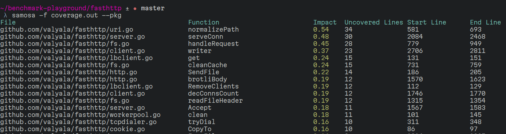

<div align="center">
    
</div>

---

# Samosa

Samosa helps developers prioritize what needs to be tested.

> ⚠️ Do not chase coverage metrics. When a measure becomes a target, it ceases to be a good measure.

Samosa isn't a tool for developers who want to chase 100% coverage; instead, it provides a good way to prioritize which functions should be tested first.

## Features

With Samosa, you can:

- Get the list of functions sorted by the impact of covering it. (see [impact](#impact))
- Sort files based on file paths.
- Exclude and include files.
- Export results to CSV, JSON, etc.

## Installation

Using go get:

```
go install -v github.com/burntcarrot/samosa/cmd/samosa@latest
```

## Usage

```
$ samosa --help
Usage:
   [flags]

Flags:
  -x, --exclude string   Exclude results for specified file
  -e, --export string    Export results to CSV, JSON, etc.
  -f, --file string      Coverage file path
  -h, --help             help for this command
  -i, --include string   Include results for specified file
  -o, --output string    Output filename for exporting results
  -p, --pkg              Use package-based path
  -s, --sort-file        Sort results based on file path
```

Run Samosa:

```
samosa -f <path to coverage file> --pkg
```

Samosa returns the list of functions sorted by the impact associated with covering it:

```
File                                                    Function        Impact  Uncovered Lines Start Line      End Line
github.com/burntcarrot/samosa/internal/coverage.go      getFunctionInfo 19.15   18              46              84
github.com/burntcarrot/samosa/internal/table.go         printTable      14.89   14              20              46
github.com/burntcarrot/samosa/internal/coverage.go      coverage        13.83   13              127             152
github.com/burntcarrot/samosa/internal/coverage.go      GetCoverageData 9.57    9               154             170
github.com/burntcarrot/samosa/internal/coverage.go      getFunctions    7.45    7               87              104
github.com/burntcarrot/samosa/internal/utils.go         sortFuncInfo    7.45    7               13              27
github.com/burntcarrot/samosa/internal/utils.go         formatImpact    7.45    7               45              56
github.com/burntcarrot/samosa/internal/coverage.go      Visit           6.38    6               106             124
github.com/burntcarrot/samosa/internal/utils.go         getFilename     5.32    5               29              37
github.com/burntcarrot/samosa/internal/coverage.go      getProfiles     4.26    4               36              43
github.com/burntcarrot/samosa/internal/table.go         trimString      3.19    3               12              18
```

Samosa allows exporting results to CSV, JSON, etc.

```
$ samosa -f coverage.out -e csv -o test.csv
 INFO  Saved results to test.csv!

$ tv test.csv

      tv dim: 10 x 6
      file                 pkg_file             function           start_line end_line uncovered_lines
1     /home/aadhav/projec… github.com/burntcar… PrintTable         20         46       14
2     /home/aadhav/projec… github.com/burntcar… filterByRegex      30         41       8
3     /home/aadhav/projec… github.com/burntcar… sortFuncInfo       14         28       7
4     /home/aadhav/projec… github.com/burntcar… GetCoverageData    161        173      3
5     /home/aadhav/projec… github.com/burntcar… coverage           134        159      2
6     /home/aadhav/projec… github.com/burntcar… FilterFunctionInfo 175        202      2
7     /home/aadhav/projec… github.com/burntcar… getFunctionInfo    53         91       2
8     /home/aadhav/projec… github.com/burntcar… getFilename        43         51       2
9     /home/aadhav/projec… github.com/burntcar… getFunctions       94         111      1
10    /home/aadhav/projec… github.com/burntcar… formatImpact       59         70       1
```

## Screenshots

Running samosa on [valyala/fasthttp](https://gist.github.com/burntcarrot/5985297bba960030c818ef2e194e3a8b):



More examples:

- [kubernetes/klog](https://gist.github.com/burntcarrot/8b7f42f2aac733056e285b8e973ac967)

## Impact

Impact = `((total covered lines + uncovered lines in function) / total number of lines)) - total coverage`

Which is equivalent to:

Impact = Coverage after covering the function - old coverage

## License

Samosa is licensed under the MIT License.
